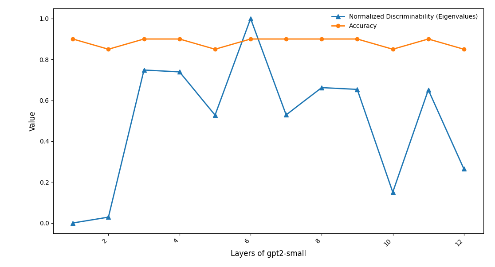

# discriminative-activation-steering

### A toolkit for interpreting and steering neural network activations along discriminative axes. 

Why do we want to steer along discriminative axes? 

Right now, the latest literature in activation editing primarily focuses on computing steering vectors (SVs) through mean differences of the activations or from probe models (e.g., linear or logistic regression models).
Rimsky et al (2024)[https://arxiv.org/pdf/2312.06681] extracts the neural activations from the token with contrastive responses to construct SVs. Coincidentally, they find that perturbing the model to reduce sycophancy, simultaneously increases the model's level of honesty [https://www.alignmentforum.org/posts/zt6hRsDE84HeBKh7E/reducing-sycophancy-and-improving-honesty-via-activation]. Moreover, Li et al (2023) constructs a linear probe model to identify linear directions for truth. Li et al then designed an *inference-time intervention* that (1) selects maximally predictive attention heads and (2) injects a truthful directions in the residual stream. 
One challenge with this is that probe models are highly overparameterized and can exploit spurious features in the text to learn how to shift activations. 

Activation editing could represent a powerful, minimally-invasive, and computationally efficient method to shift model responses towards desirable behavioral dynamics.

However, as Tan et al [https://arxiv.org/pdf/2407.12404] suggests, there are a few critical  challenges. 

* In-distribution steering: steering is highly dependent on the variance of the input features 
* Out-of-distribution steering: activation editing shows some level of generalizability, but some features are resistant to the effects of steering

A model's steerability bias (introduced by Tan et al) is highly dependent on the feature you wish to inject, on whether there are spurious factors that the model can exploit. 

This idea motivated my current work: 

While these approaches are effective, they are **variance-agnostic**: they do not account for how much activations fluctuate within each class. This can limit robustness, particularly for out-of-distribution inputs. We want to ensure that when our activations are projected by the constructed steer vector that it minimizes the within-class variance (adjusting for spurious features)! Furthermore, that the projection finds a maximally discriminative axis which ideally encodes the relevant dimension. 

## Modules 

- **DiscriminativeSteerer:** Apply steering vectors along discriminative axes to modify model activations.
- **DiscriminativeVisualizer:** Visualize projections of activations, layer-wise impact, and class separability.

## TO DO 

- [X] Read up on transformer_lens library for activation caching 
- [X] Write and go through end-to-end mathematical derivation of Fisher criterion to closed form solution
- [X] Write initial modules for Steerer and Visualizer
- [X] Run the pipeline to ensure it works and debug errors 
- [ ] Finish writing modules for Steerer and Visualizer 
    - [ ] Define a function to try a naive representational ablations
    - [X] Compute the eigenvalue as a metric for relative discriminability 
    - [ ] Define function to decode the responses for ood examples 


### How to Use

```python
from discriminative import DiscriminativeSteerer, DiscriminativeVisualizer
import pandas as pd

# 1️⃣ Initialize the steerer
model_name = "gpt2-small"  # replace with your model
steerer = DiscriminativeSteerer(model_name=model_name, d_model=768)

# 2️⃣ Load contrastive prompts
df = pd.read_csv("contrastive_prompts.csv")
n_pairs = 50

# 3️⃣ Extract activations
logits, cache, model = steerer.extract_activations_from_prompts(df, n_pairs)

# 4️⃣ Run LDA sweep across all layers
steerer.sweep_linear_discriminant_analysis(save_dir="analysis")

# 5️⃣ Access cached results
steerer.cached_results
```

Cached results looks likes: 
```python
{
    "layer": layer,  # Layer number
    "params": {
        "projected": Projecting activations onto the discriminative axis v @ X,
        "coeffs": The steering vector, v,
        "coeff_norm": Euclidean norm of the steering vector, |v|,
        "predictions": Model predictions of the classes when projected
    },
    "explained_variance": Explained variance,
    "accuracy": accuracy_score(y_true, y_pred),
    "confusion_matrix": confusion_matrix(y_true, y_pred),
    "classification_report": classification_report(y_true, y_pred) in dictionary format
}
```

```python
visualizer = DiscriminativeVisualizer(steerer=steerer)
label_dict = {0: "Negative", 1: "Positive"}

visualizer.plot_discriminative_projections(
    plot_title="Layerwise Discriminative Projections",
    label_dict=label_dict,
    alpha=0.85  # scatter point transparency
)

visualizer.plot_discriminability_
```
Visualizer projects activation onto discriminative axis and plots overlaid a distribution over so you can visualize which layer is maximally performant for discriminating features 


```python

visualizer.plot_discriminability_per_layer(
    normalize_eigenvalues=True
) # Plots how discriminative each layer is using accuracy and recovered eigenvalues 

```


Often probe models have high accuracy for all the layers. It is possible that this discriminative projection also can perform high accuracy for all the layers, which is why the eigenvalue may be a useful diagnostic metric to check which layer has best separability. 

Note that the eigenvalue is computed through sum of between-class variance / sum of within-class variance. Intuitively, this means we want to find a plane or hyperplane to project all our contrastive examples such that it maximizes the separation of the classes and ensures the examples from the same class are as close together as possible. We can see that while many of the layers are accurate for use to classify or identify linear directions of sycophancy, layer 3 actually has the highest eigenvalue. 

It may be hard to interpret eigenvalues but we just care about which layer recovers the largest eigenvalues, so there is an option to normalize. 


## Mathematic explanation 

The **Fisher criterion** provides a principled, variance-aware approach to identify discriminative directions. It selects a vector $\( \mathbf{v} \)$ that **maximizes the separation between class means relative to within-class variance**:

### Define the Fisher criterion:

```math
\text{Fisher criterion: } J(\mathbf{v}) = \frac{ (\mathbf{v}^\top \mu_1 - \mathbf{v}^\top \mu_2)^2 } { \sum_{k=1}^{K} \sum_{x_n \in C_k} (\mathbf{v}^\top (x_n - \mu_k))^2 } 
```
where $v$ is the projection direction, $μ_{k}$ is the mean of class k, $x_{n}$ are the data points in class k. For simplicity we will treat k as 2, thus a binary classification problem.

### Rewrite in matrix form 

```math 
\text{Let } S_b = (\mu_1 - \mu_2)(\mu_1 - \mu_2)^\top \quad \text{(between-class scatter)} 
```
```math
\text{Let } S_w = \sum_{k=1}^{K} \sum_{x_n \in C_k} (x_n - \mu_k)(x_n - \mu_k)^\top \quad \text{(within-class scatter)} 
```
```math
\text{Then: } \quad \arg\max_{\mathbf{v}} J(\mathbf{v}) = \arg\max_{\mathbf{v}} \frac{\mathbf{v}^\top S_b \mathbf{v}}{\mathbf{v}^\top S_w \mathbf{v}}
```

### Formulate problem as a generalized eigenvalue problem

Maximizing the Rayleigh quotient leads to a generalized eigenvalue problem:

```math
S_b \mathbf{v} = \lambda S_w \mathbf{v}
```

λ is the eigenvalue (the optimal Rayleigh quotient). v is the eigenvector corresponding to the maximum separation direction. The lambda also gives us a nice value to describe the discriminability of the class relative to the noise within the classes. This could be useful perhaps when we ablate the residual stream and see the respective impact on lambda (i.e., how does it affect the relative discriminability with respects to input variance). 

### Closed-form solution for binary classes

For K = 2, the solution simplifies to:
```math 
 \mathbf{v}_{\text{Fisher}} = S_w^{-1} (\mu_1 - \mu_2)
```
```math
\mathbf{v}_{\text{Fisher}} \propto \mathbf{S}_w^{-1} (\mu_1 - \mu_0)
```
- $\mu_1$, mean activations of the first class
- $\mu_0$ mean activations of the second class 
- $\mathbf{S}_w$  is the within-class covariance matrix of activations.


Intuitively, the objective of the Fisher criterion is to find a $v$ direction in the feature such that the projected class means are as far apart and the within-class variance is as small as possible. Given that the Fisher criterion minimizes within-class variance, this could improve robustness especially for both in-distribution and out-of-distribution steering. Moreover, this criterion enables us to downweight directions of the model activations varies quite a lot because they are noisy for steering.This align with Tan et al.'s observation that some features are resistant to steering because high within-class variance diminshes the effect of a linear intervention. 

There are many packages that already do this. For instance, the Linear Discriminant Analysis package in scikit-learn which we use. 

### $v$ as the basis for a SV 


Given:
- activation vector $a$ $\in$ $\mathbb{R}^d$
- Fisher discriminant direction $v_{\text{Fisher}}$
- intervention strength $\alpha \in \mathbb{R} $

we apply the steering intervention:
## Layer Selection Criterion
```math

\ell^\star
=
\arg\max_{\ell}
\lambda_{\max}^{(\ell)}

```
## Steering Intervention

```math

a^{(\ell^\star)}_{\text{new}}
=
a^{(\ell^\star)} + \alpha \, v_{\text{Fisher}}^{(\ell^\star)}

```


The vector, $v$, is a maximally discriminative axis that allows us to seprate not just contrastive examples but separate features or behavior (think honesty and sycophancy), while adjusting for and minimizing within-class variance. This discriminative axis forms the basis of our steering vector. 

There are likely different ways of extending this: 

- **multidimensional steering**: Expanding work towards multidimensional steering by find a k_classes $-1$ discriminative hyperplane 

- **contrastive features**: - **Contrastive features:** Discriminative steering could potentially be extended to a k_classes $\times 2$ framework, where we compute orthogonal steering axes for each class pair. This would allow fine-grained control over multiple behavioral features simultaneously.
scriminative steering could potentially allow for a num_classes x 2$ steering if we find ways to further 


